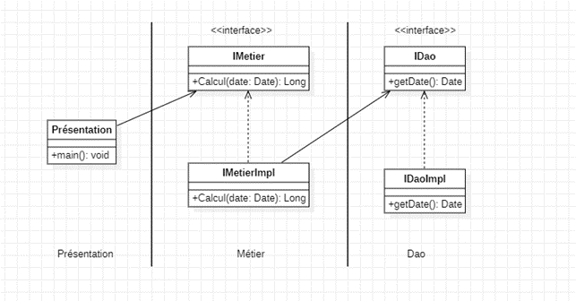

# Partie 1 : Application du support et vidéo
## 1.	Schématisation du problème
On cherche à réaliser le schéma suivant :



## 2.	Couche DAO
On crée l’interface IDao
```java
public interface IDao {
    Date getDate();
}
```

Puis son implémentation dans IDaoImpl
```java
public class IDaoImpl implements IDao{
    @Override
    public Date getDate() {
        return new Date();
    }
}
```

## 3.	Couche métier
On crée l’interface IMetier
```java
public interface IMetier {
    long calcul(Date date);
}
```

Puis son implémentation dans IMetierImpl en utilisant un couplage faible
```java
public class MetierImpl implements IMetier {
    private IDao dao; //Couplage faible
    @Override
    public double calcul() {
        double temperature = dao.getData();
        return temperature * 54;
    }
    public void setDao(IDao dao) {
        this.dao = dao;
    }
}
```
## 4.	Injection des dépendances
Maintenant afin d’assurer la communication entre la classe ImetierImpl et Dao, il faut injecter la dépendance. Ceci peut se réaliser à travers 2 méthodes :
### Instanciation statique
Dans la couche présentation, on crée une classe ResentationStat où on appliquera une injection statique des dépendances.

`Note` : Cette classe joue le rôle de Factory Class, elle génère les dépendances.

Dans l’exemple ci-dessous on veut chercher la différence de date entre « 2001-01-01 » et aujourd’hui.

```java
public class PresentationStat {
    public static void main(String[] args){
        IDaoImpl dao = new IDaoImpl();
        IMetierImpl metier = new IMetierImpl();
        metier.setDao(dao);
        Long days=0L;
        try {
         days=metier.calcul(new.SimpleDateFormat("yyyy-MM-dd").parse("2001-01-01"));
        }catch (ParseException e){
            e.printStackTrace();
        }
        System.out.println("le nombre de jours est : "+days);
    }
}
```
### Instanciation dynamique

Toujours dans le contexte de « code ouvert à l’extension et fermé à la modification » , l’instanciation statique nous oblige à modifier le code au cas où on crée une nouvelle extension. 
Instanciation dynamique par contre injecte automatiquement les dépendances sans changer de codes. Il suffit de modifier le fichier config.txt.

```java
public class PresentationDyn {
    public static void main(String[] args) throws Exception {
        //Lecture du fichier conf.txt
        Scanner scanner = new Scanner(new File("src/main/conf.txt"));

        String daoClassName = scanner.nextLine();
        Class cDao = Class.forName(daoClassName);
        IDao dao = (IDao) cDao.newInstance(); //Instanciation dynamique des classes

        String metierClassName = scanner.nextLine();
        Class cMetier =Class.forName(metierClassName);
        IMetier metier =(IMetier) cMetier.newInstance();
        //Maintenant on a besoin de la méthode Calcul
        Method method =cMetier.getMethod("setDao",IDao.class);
        method.invoke(metier,dao);

        System.out.println(dao.getDate());
        System.out.println(metier.calcul(new Date()));
    }
}
```

Le fichier config.txt contient les noms et chemin des classes utilisées.

```txt
ma.enset.dao.IDaoImpl
ma.enset.metier.IMetierImpl
```

## 5.	Framework Spring
Pour cette partie on exploite le framework Spring pour injecter les dépendances automatiquement :

### Par XML
```java
Class PresentationXml
public class PresSpringXML {
    public static void main(String[] args) {
        ApplicationContext context = new ClassPathXmlApplicationContext("applicationContext.xml");
        IMetier metier = (IMetier) context.getBean("metier");
        System.out.println(metier.calcul());
    }
}
```

Voici la structure du fichier applicationContext.XML

```XML
<?xml version="1.0" encoding="UTF-8"?>
<beans xmlns="http://www.springframework.org/schema/beans"
       xmlns:xsi="http://www.w3.org/2001/XMLSchema-instance"
       xsi:schemaLocation="http://www.springframework.org/schema/beans http://www.springframework.org/schema/beans/spring-beans.xsd">
    <bean id="dao" class="ma.enset.ext.DaoImplVWS"/>
    <bean id="metier" class="ma.enset.metier.MetierImpl">
        <property name="dao" ref="dao"/>
    </bean>
</beans>
```

### Par annotations

```java
Class Presentation Annotation
public class PreSpringAnnotations {
    public static void main(String[] args) {
        ApplicationContext context = new AnnotationConfigApplicationContext("ma.enset.dao","ma.enset.metier");
        IMetier metier =context.getBean(IMetier.class);
        System.out.println(metier.calcul());
    }
}
```
