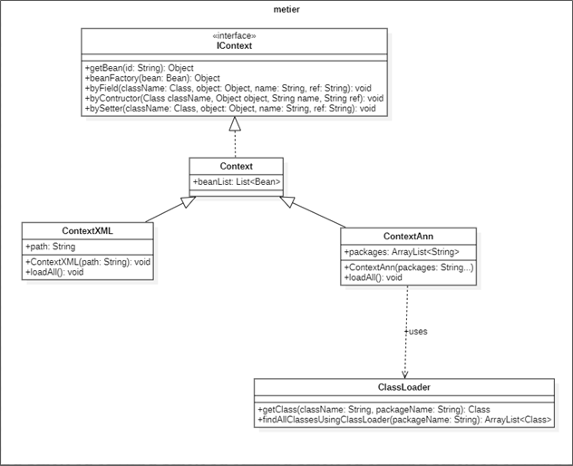

# Partie 2 : Framework Injection des dépendances

---
Dans cette partie, on cherche à développer un Framework qui permettra au développeur de faire l’injection des dépendances.
La structure de nos classes seront comme suivant :



## Entités
On utilisera la dépendance JAXB pour cette partie.
Dans le package dao, on définit les entités à extraire
-	`Beans` : c’est l’élement racine
-	`Bean`: désigne une classe
-	`Property` : fait référence à la méthode d’injection

### Class Bean
```java
@XmlRootElement(name = "bean")
@XmlAccessorType(XmlAccessType.FIELD)
public class Bean {
    private String id;
    private String className;
    //Property
    @XmlElement(name = "property")
    private Property property;

//Setters et Getters

}
```
### Class Beans
```java
@XmlRootElement(name = "beans")
@XmlAccessorType(XmlAccessType.FIELD)
public class Beans{
    @XmlElement(name = "bean")
    public List<Bean> beanList = null;

    public List<Bean> getBeanList() {
        return beanList;
    }

    public void setBeanList(List<Bean> beanList) {
        this.beanList = beanList;
    }
}
```
### Class Property
```java
@XmlRootElement(name = "property")
@XmlAccessorType(XmlAccessType.FIELD)
public class Property{
    String name;
    String ref;
//Getters et setters
}
```
## Annotations

### Annotation Service 
```java
@Target({ElementType.TYPE})
@Retention(RetentionPolicy.RUNTIME)
public @interface Service {
    String value() default "";
}
```
### Annotation AutoWired
```java
@Target({ElementType.CONSTRUCTOR, ElementType.METHOD, ElementType.PARAMETER, ElementType.FIELD, ElementType.ANNOTATION_TYPE})
@Retention(RetentionPolicy.RUNTIME)
public @interface Autowired {
    boolean required() default true;
}
```
## 1. A travers un fichier XML
Pour ceci, on adopte la structure du fichier XML suivante :

```xml
<?xml version="1.0" encoding="UTF-8" standalone="yes"?>
<beans>
    <bean>
        <id>dao</id>
        <className>enset.ext.DaoImplVWS</className>
    </bean>
    <bean>
        <id>metier</id>
        <className>enset.metier.MetierImpl</className>
        <property>
            <name>Dao</name>
            <ref>dao</ref>
        </property>
    </bean>
</beans>
```
Voici le processus d'extraction des données


### Class ContextXML
```java
public class ContextXML extends Context{
    String path;
    public ContextXML(String path) {
        this.path = path;
        loadAll();
    }

    public void loadAll() {
        try {
            JAXBContext context = JAXBContext.newInstance(Beans.class);
            Unmarshaller unmarshaller = context.createUnmarshaller();
            Beans beans = (Beans) unmarshaller.unmarshal(Context.class.getResourceAsStream("/"+path));
            for (Bean bean : beans.getBeanList()) {
                beanList.add(bean);
            }
        }catch (JAXBException e) {
            throw new RuntimeException(e);
        }
    }

}
```
## 2. A travers des annotations

### Class ContextAnn
```java
public class ContextAnn extends Context{
    ArrayList<String> packages = new ArrayList<>();
    public ContextAnn(String... packages) {
        for (String pack : packages) {
            this.packages.add(pack);
        }
        loadAll();
    }

    public void loadAll() {
        for (String pack : packages) {
            //Search all classes in the package
            ClassesLoader classesLoader = new ClassesLoader();
            ArrayList<Class> classes = classesLoader.findAllClassesUsingClassLoader(pack);
            for (Class className : classes) {
                //Search all annotations in the class
                if (className.isAnnotationPresent(Service.class)) {
                    Service service = (Service) className.getAnnotation(Service.class);
                    Bean bean = new Bean();
                    if (!service.value().equals(""))bean.setId(service.value());
                    Boolean isDone = false;
                    //Trouver Autowired annotation
                    /*Traitement à faire | voir le code source*/
                    
                    //S'il n'y a pas d'Autowired annotation
                    /*Traitement à faire | voir le code source*/
                    
                    //S'il s'agit d'un Constructor
                    /*Traitement à faire | voir le code source*/
                }
            }
        }
    }
}
````

## 3. Démonstration du framework
[Voir Projet TestFrameworkIOC](../TestFrameworkIOC/README.md)
