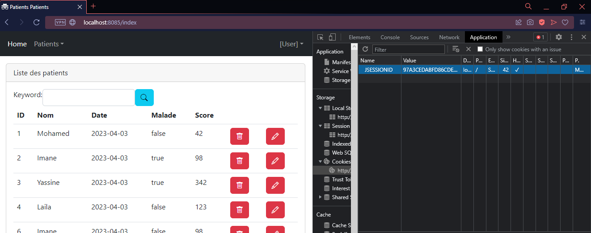

# Spring Secutity - Spring Boot | Statefull authentication

## Prérequis
Nous allons cloner le projet suivant :
`https://github.com/mohamedYoussfi/unsecured-hospital-app.git`

## 1. Statefull authentication

Dans notre projet, on crée un nouveau package `security` et on crée une classe `SecurityConfig` qui va nous permettre de configurer la sécurité de notre application.

On va utiliser la librairie Spring Security pour cela.
Dans le fichier `pom.xml`, on ajoute la dépendance suivante :
```xml
<dependency>
    <groupId>org.springframework.boot</groupId>
    <artifactId>spring-boot-starter-security</artifactId>
</dependency>
<dependency>
    <groupId>org.springframework.boot</groupId>
    <artifactId>spring-boot-starter-test</artifactId>
    <scope>test</scope>
</dependency>
<dependency>
    <groupId>org.springframework.security</groupId>
    <artifactId>spring-security-test</artifactId>
    <scope>test</scope>
</dependency>
```

## 2. Configuration de la sécurité | SecurityConfig

Pour dire que toutes les requêtes doivent être authentifiées :
```java
@Configuration
@EnableWebSecurity
public class SecurityConfig {
    @Bean //Méthode qui s'exécute au démarrage de l'application
    public SecurityFilterChain securityFilterChain(HttpSecurity httpSecurity) throws Exception {
        httpSecurity.formLogin();
        httpSecurity.authorizeHttpRequests().anyRequest().authenticated();
        //Toutes les requêtes doivent être authentifiées
        return httpSecurity;
    }
}
```

Pour tester l'intégration de Spring Security, on accède au lien suivant :
`http://localhost:8085/login`

Maintenant, on va créer un utilisateur pour pouvoir se connecter à notre application.

Dans la classe `SecurityConfig`, on ajoute la méthode suivante :
```java
@Bean
public InMemoryUserDetailsManager inMemoryUserDetailsManager(){
    return new InMemoryUserDetailsManager(
        User.withUsername("user").password("{noop}1234").roles("USER").build(),
        User.withUsername("admin").password("{noop}1234").roles("USER","ADMIN").build()
        );
}
```

> **Explication** : 
> 
> * `{noop}` : On indique que le mot de passe n'est pas encodé.
> 
> * `roles("USER","ADMIN")` : On indique que l'utilisateur a les rôles `USER` et `ADMIN`.
> 
> * `User.withUsername("user").password("{noop}1234").roles("USER").build()` : On crée un utilisateur avec le nom `user`, le mot de passe `1234` et le rôle `USER`.

On peut maintenant se connecter avec l'utilisateur `user` et le mot de passe `1234`.

Si on vérifie la situation du Network, on trouve que le cookie `JSESSIONID` a été créé.
Cette valeur est utilisée pour identifier l'utilisateur.



La valeur du cookie `JSESSIONID` : `97A3CEDABFD86CDEEFB6D612266FD201`

Pour se déconnecter, on accède au lien suivant :
`http://localhost:8085/logout`

On peut voir que le cookie `JSESSIONID` a été supprimé.


## 2. PasswordEncoder

On va maintenant utiliser un `PasswordEncoder` pour encoder le mot de passe.

Dans la classe `SecurityConfig`, on ajoute la méthode suivante :
```java
@Bean
    PasswordEncoder passwordEncoder(){
        return new BCryptPasswordEncoder();
    }
```

On déclare un objet `PasswordEncoder` qui va utiliser l'algorithme `BCrypt`.
```java
@Autowired
    private PasswordEncoder passwordEncoder;
```

Maintenant, on va utiliser cet objet pour encoder le mot de passe.
```java
User.withUsername("user").password(passwordEncoder.encode("1234")).roles("USER").build(),
User.withUsername("admin").password(passwordEncoder.encode("1234")).roles("USER","ADMIN").build()
```

## 3. Thymeleaf extra-springsecurity6

On va maintenant utiliser la librairie `Thymeleaf extra-springsecurity6` pour gérer la sécurité dans les templates.

Dans le fichier `pom.xml`, on ajoute la dépendance suivante :
```xml
<!-- https://mvnrepository.com/artifact/org.thymeleaf.extras/thymeleaf-extras-springsecurity6 -->
<dependency>
    <groupId>org.thymeleaf.extras</groupId>
    <artifactId>thymeleaf-extras-springsecurity6</artifactId>
    <version>3.1.0.M1</version>
</dependency>
```
Cette librairie permet de gérer la sécurité dans les templates.

Dans le fichier `template.html`, on modifie la balise contenant [User] comme suit :
```html
a class="nav-link dropdown-toggle" href="#" role="button" data-bs-toggle="dropdown"
            th:text="${#authentication.name}"></a>
```
On peut maintenant voir le nom de l'utilisateur connecté.


## 4. Dev Tools

On va maintenant utiliser la librairie `Dev Tools` pour recharger automatiquement l'application après chaque modification.

Dans le fichier `pom.xml`, on ajoute la dépendance suivante :
```xml
<!-- https://mvnrepository.com/artifact/org.springframework.boot/spring-boot-devtools -->
<dependency>
    <groupId>org.springframework.boot</groupId>
    <artifactId>spring-boot-devtools</artifactId>
    <scope>runtime</scope>
    <optional>true</optional>
</dependency>
```
Cette librairie permet de recharger automatiquement l'application après chaque modification.

Pour activer cette fonctionnalité, on ajoute la ligne suivante dans le fichier `application.properties` :
```properties
spring.devtools.restart.enabled=true
```

On peut maintenant modifier le code et voir les modifications sans avoir à redémarrer l'application.

> Contrôle le `17/03/2023`
> - [ ] Entités JPA
> - [ ] Thymeleaf
> - [ ] Annotations
> - [ ] Spring Security


