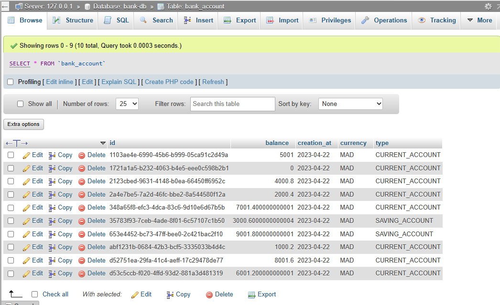
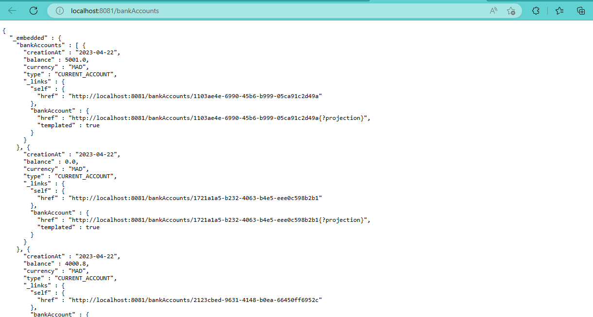
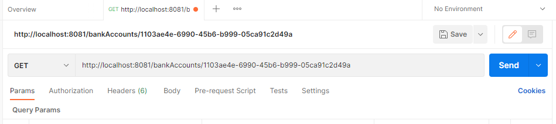
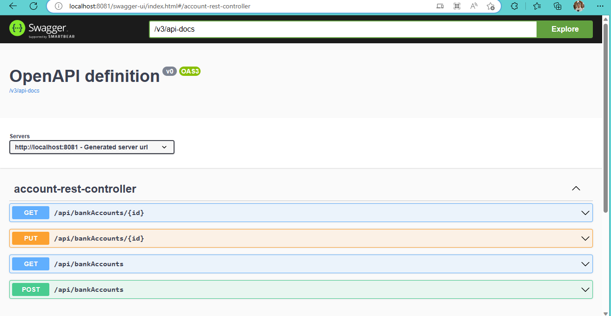
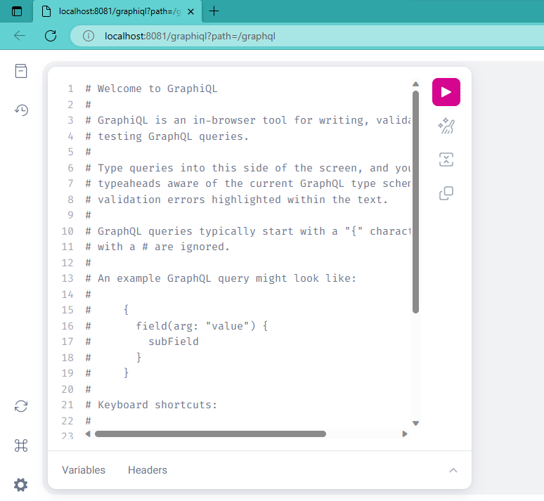
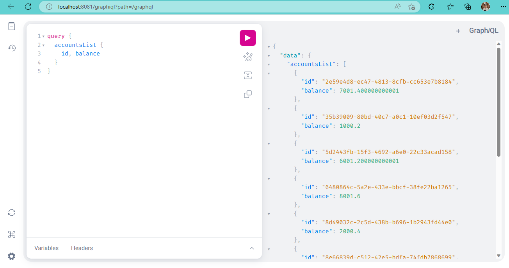
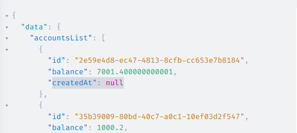
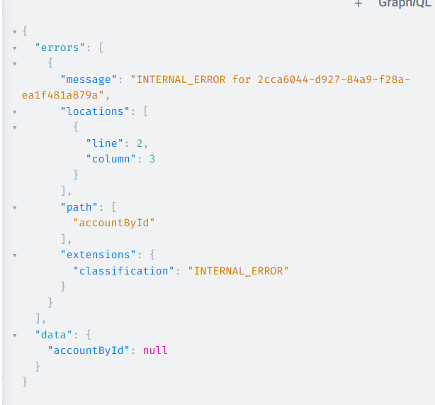
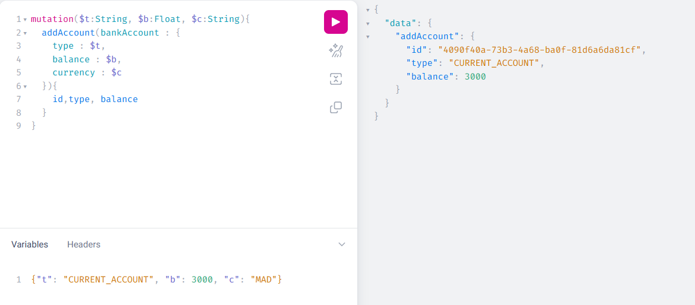

# Mise en oeuvre d'un micro-service | Gestion des comptes bancaires

## Objectif
Dans cette application, nous allons mettre en oeuvre un micro-service permettant de gérer des comptes bancaires.

## Initialisation du projet
Pour initialiser le projet, nous allons utiliser le générateur de projet Spring Initializr. Pour cela, nous allons utiliser l'URL suivante : https://start.spring.io/

Nous allons créer un projet Maven avec les dépendances suivantes :
- Spring Web
- Spring Data JPA
- Spring GraphQL
- H2 Database
- Lombok

## Création des entités JPA
On crée le package `com.example.bankaccount.model` et on y ajoute les entités suivantes :
- BankAccount
```java
@Entity @NoArgsConstructor @AllArgsConstructor @Builder
@Getter @Setter
public class BankAccount {
    @Id
    private String id;
    @Temporal(javax.persistence.TemporalType.DATE)
    private Date creationAt;
    private Double balance;
    private String currency;
    @Enumerated(EnumType.STRING)
    private AccountType type;

}
```
- AccountType (enum)
```java
public enum AccountType {
    CURRENT, SAVINGS
}
```

## Création du repository JPA

On crée le package `com.example.bankaccount.repository` et on y ajoute l'interface suivante :
- BankAccountRepository
```java
@RepositoryRestResource
public interface BankAccountRepository extends JpaRepository<BankAccount, String>{
    @RestResource(path = "/byType")
    List<BankAccount> findByType(@Param("t") AccountType type);
    List<BankAccount> findByCurrency(String currency);
}
```
- On ajoute l'annotation `@RepositoryRestResource` pour que Spring Data REST génère automatiquement les endpoints REST pour cette interface.
- On ajoute l'annotation `@RestResource(path = "/byType")` pour que Spring Data REST génère automatiquement l'endpoint REST suivant : `http://localhost:8080/bankAccounts/search/byType?t=CURRENT`

## Création des DTOs
Les DTOs sont des objets qui vont nous permettre de mapper les données entre les entités JPA et les objets GraphQL.

On crée le package `com.example.bankaccount.dto` et on y ajoute les DTOs suivants :
- BankAccountRequestDTO
```java
@Data @NoArgsConstructor @AllArgsConstructor @Builder
public class BankAccountRequestDTO {
    private Double balance;
    private String currency;
    private AccountType type;
}
```
- BankAccountResponseDTO
```java
@Data @NoArgsConstructor @AllArgsConstructor @Builder
public class BankAccountResponseDTO {
    private String id;
    private Date creationAt;
    private Double balance;
    private String currency;
    private AccountType type;
}
```

## Création des mappers
Les mappers sont des objets qui vont nous permettre de mapper les données entre les entités JPA et les objets GraphQL.

On crée le package `com.example.bankaccount.mapper` et on y ajoute les mappers suivants :
- AccountMapper
```java
@Component
public class AccountMapper {
    public BankAccountResponseDTO fromBankAccount(BankAccount bankAccount) {
        BankAccountResponseDTO bankAccountResponseDTO = new BankAccountResponseDTO();
        BeanUtils.copyProperties(bankAccount, bankAccountResponseDTO);
        return bankAccountResponseDTO;
    }

}

```

## Création du service DAO
On crée le package `com.example.bankaccount.service` et on y ajoute l'interface suivante :
- AccountService
```java
public interface AccountService {
    BankAccountResponseDTO addAccount(BankAccountRequestDTO bankAccountDTO);
}
```
On crée ensuite l'implémentation de cette interface :
- AccountServiceImpl
```java
@Service
@Transactional
public class AccountServiceImpl implements AccountService {
    @Autowired
    private BankAccountRepository bankAccountRepository;
    @Autowired
    private AccountMapper accountMapper;
    @Override
    public BankAccountResponseDTO addAccount(BankAccountRequestDTO bankAccountDTO) {
        BankAccount bankAccount = BankAccount.builder()
                .id(UUID.randomUUID().toString())
                .creationAt(new java.util.Date())
                .balance(bankAccountDTO.getBalance())
                .type(bankAccountDTO.getType())
                .currency(bankAccountDTO.getCurrency())
                .build();
        BankAccount savedBankAccount=bankAccountRepository.save(bankAccount);
        return accountMapper.fromBankAccount(savedBankAccount);
    }
}

```

Ici on exploite le `Builder` de Lombok pour créer une instance de `BankAccount` à partir de `bankAccountDTO`.


## Test de l'application
Dans la classe `BankAccountServiceApplication` on ajoute le code suivant :
```java
@SpringBootApplication
public class BankAccountServiceApplication {

	public static void main(String[] args) {
		SpringApplication.run(BankAccountServiceApplication.class, args);
	}
	@Bean
	CommandLineRunner start(BankAccountRepository bankAccountRepository){
		return args -> {
			for (int i = 0; i < 10; i++) {
				bankAccountRepository.save(BankAccount.builder()
						.id(UUID.randomUUID().toString())
						.creationAt(new java.util.Date())
						.balance(i*1000.2)
						.currency("MAD")
						.type(Math.random()>0.5? AccountType.CURRENT_ACCOUNT:AccountType.SAVING_ACCOUNT)
						.build());
			}
		};
	}

}
```

On note que l'on a ajouté l'annotation `@Bean` sur la méthode `start` pour que Spring puisse l'instancier.

Ici, on n'a pas utilisé les mapper et le service DAO pour créer les comptes bancaires. On a directement utilisé le repository JPA.

On lance l'application et on vérifie que les comptes bancaires depuis phpMyAdmin.



##  Web service Restfull qui permet de gérer des comptes

On va maintenant créer un web service Restfull qui permet de gérer des comptes bancaires.

On va utiliser Spring Data REST pour générer automatiquement les endpoints REST.

Dans notre cas, on a déjà créé l'interface `BankAccountRepository` qui étend `JpaRepository`. On a aussi ajouté l'annotation `@RepositoryRestResource` sur cette interface.

On va donc pouvoir utiliser Spring Data REST pour générer automatiquement les endpoints REST.

On va tester les endpoints suivants :
- `http://localhost:8081/bankAccounts` : pour récupérer la liste des comptes bancaires


## Contrôleur REST
On va créer un contrôleur REST qui va permettre de gérer les comptes bancaires.

On crée le package `com.example.bankaccount.web` et on y ajoute la classe suivante :

- AccountRestController
```java
@RestController
@RequestMapping("/api")
public class AccountRestController {
    private BankAccountRepository bankAccountRepository;
    private AccountService accountService;
    private AccountMapper accountMapper;

    public AccountRestController(BankAccountRepository bankAccountRepository, AccountService accountService, AccountMapper accountMapper) {
        this.bankAccountRepository = bankAccountRepository;
        this.accountService = accountService;
        this.accountMapper = accountMapper;
    }

    @GetMapping("/bankAccounts")
    public List<BankAccount> bankAccounts(){
        return bankAccountRepository.findAll();
    }
    @GetMapping("/bankAccounts/{id}")
    public BankAccount bankAccounts(String id){
        return bankAccountRepository.findById(id).orElseThrow(()->new RuntimeException(String.format("Account %s not found",id)));
    }

    /*En utilisant la projection*/
    @PostMapping("/bankAccounts")
    public BankAccountResponseDTO save(@RequestBody BankAccountRequestDTO requestDTO){
        return accountService.addAccount(requestDTO);
    }

    @PutMapping("/bankAccounts/{id}")
    public BankAccount update(String id, @RequestBody BankAccount bankAccount){
        BankAccount account = bankAccountRepository.findById(id).orElseThrow();
        if (bankAccount.getBalance()!=null) account.setBalance(bankAccount.getBalance());
        if (bankAccount.getCurrency()!=null) account.setCurrency(bankAccount.getCurrency());
        if (bankAccount.getType()!=null) account.setType(bankAccount.getType());
        if (bankAccount.getCreationAt()!=null) account.setCreationAt(new Date());
        return bankAccountRepository.save(account);
    }

}
```

On note que l'on a utilisé la projection `BankAccountResponseDTO` pour la méthode `save`.

## Test de l'application
On lance l'application et on teste les endpoints suivants :
- `http://localhost:8081/api/bankAccounts` : pour récupérer la liste des comptes bancaires
- `http://localhost:8081/api/bankAccounts/1` : pour récupérer le compte bancaire dont l'identifiant est 1
- `http://localhost:8081/api/bankAccounts` : pour ajouter un compte bancaire
```json
{
    "balance": 1000,
    "currency": "MAD",
    "type": "CURRENT_ACCOUNT"
}
```
- `http://localhost:8081/api/bankAccounts/1` : pour modifier le compte bancaire dont l'identifiant est 1
```json
{
    "balance": 1000,
    "currency": "MAD",
    "type": "CURRENT_ACCOUNT"
}
```

## Client REST Postman
On va utiliser Postman pour tester les endpoints REST.



On obtient le résultat suivant :

```json
{
  "creationAt": "2023-04-22",
  "balance": 5001.0,
  "currency": "MAD",
  "type": "CURRENT_ACCOUNT",
  "_links": {
    "self": {
      "href": "http://localhost:8081/bankAccounts/1103ae4e-6990-45b6-b999-05ca91c2d49a"
    },
    "bankAccount": {
      "href": "http://localhost:8081/bankAccounts/1103ae4e-6990-45b6-b999-05ca91c2d49a{?projection}",
      "templated": true
    }
  }
}
```

## Swagger
On va utiliser Swagger pour documenter notre API REST.

Swagger est un framework open source qui permet de décrire, produire, consommer et visualiser des services RESTful.

On lance l'application et on teste l'URL suivante : http://localhost:8081/swagger-ui/index.html#/account-rest-controller




## GraphQL

Pour communiquer avec le client, on va utiliser GraphQL. Il s'agit d'un langage de requête et de manipulation de données pour les API. Il fournit une approche complète et compréhensible pour la description des données.

Nous avons déjà ajouté les dépendances requises pour utiliser GraphQL, à savoir :
- `graphql-spring-boot-starter`
- `graphql-java-tools`

```xml
<dependency>
    <groupId>org.springframework.graphql</groupId>
    <artifactId>spring-graphql-test</artifactId>
    <scope>test</scope>
</dependency>
```

Dans le package `resources`, on crée le fichier `schema.graphqls` qui contient le schéma GraphQL.

- schema.graphqls
```graphql
type Query {
    accountsList: [BankAccount]
}

type BankAccount {
    id: String,
    createdAt: Float,
    balance: Float,
    currency: String,
    type: String
}
```

Voici donc un schéma GraphQL qui contient une requête `accounts` qui retourne une liste de comptes bancaires.

Pour tester, dans le package web, on crée la classe `AccountGraphQLController` qui va permettre de tester le schéma GraphQL.

- AccountGraphQLController
```java
@Controller
public class AccountGraphQLController {
    @Autowired
    private BankAccountRepository bankAccountRepository;
    @QueryMapping
    public List<BankAccount> accountsList(){
        return bankAccountRepository.findAll();
    }

}
```

La notation `@QueryMapping` permet de mapper la requête GraphQL avec la méthode `accountsList`.

NB : il faut utiliser le même nom de la requête GraphQL et de la méthode.

Pour tester, on modifie `application.properties` pour ajouter la configuration suivante :

```properties
# GraphQL
spring.graphql.graphiql.enabled=true
```

On lance l'application et on teste l'URL suivante : http://localhost:8081/graphiql

> **NB : TOUES LES REQUETES GRAPHQL SONT EN POST**



 Dans graphiql, on parle de 2 notions principales :
- Query : c'est la requête GraphQL (récupération)
- Mutation : c'est la mutation GraphQL (ajout, modification, suppression)

On teste la requête suivante :

```graphql
query {
  accountsList {
    id, balance
  }
}
```



L'avantage de GraphQL est qu'on peut récupérer ***uniquement les données dont on a besoin.*** Dans le cas précédent, on a récupéré uniquement les données `id` et `balance`.


Problème : Lorsqu'on veut récupérer la date de création, on obtient une erreur.



Pour résoudre ce problème, on prut utiliser la projection `BankAccountResponseDTO` pour mapper la date de création.

 On ajoute une nouvelle Query dans AccountGraphQLController :
```java
@QueryMapping
public BankAccount accountById(@Argument String id){
    return bankAccountRepository.findById(id).orElseThrow(()->new RuntimeException("Account not found"));
}
```

Puis dans le fichier `schema.graphqls`, on ajoute la requête suivante :
```graphql
query {
  accountById(id : "31e0e9ec-3540-4c1d-ba4d-ca8d54ecb07d"){
    balance
  }
}
```
On obtient le résultat suivant :
```json
{
  "data": {
    "accountById": {
      "balance": 5001
    }
  }
}
```

Si GraphQL ne trouve pas le compte bancaire, il retourne une erreur avec un message standard.



Pour résoudre ce problème, on va créer un handler pour gérer les exceptions.

On crée le package `exception` et on crée la classe `CustomDataFetcherExceptionResolver` qui va hériter l'interface `DataFetcherExceptionResolverAdapter`.

- CustomDataFetcherExceptionResolver
```java
@Component
public class CustomDataFetcherExceptionResolver extends DataFetcherExceptionResolverAdapter {
    @Override
    protected GraphQLError resolveToSingleError(Throwable ex, DataFetchingEnvironment env) {
        return new GraphQLError() {
            @Override
            public String getMessage() {
                return ex.getMessage();
            }

            @Override
            public List<SourceLocation> getLocations() {
                return null;
            }

            @Override
            public ErrorClassification getErrorType() {
                return null;
            }
        };
    }
}
```

On teste la requête suivante :
```graphql
query {
  accountById(id : "1"){
    balance
  }
}
```

> Nous savons très bien que le compte bancaire avec l'id 1 n'existe pas.

On obtient le résultat suivant :
```json
{
  "data": {
    "accountById": null
  },
  "errors": [
    {
      "message": "Account not found"
    }
  ]
}
```

## Mutation

On va créer 3 mutations:
- `addAccount` : permet de créer un compte bancaire
- `updateAccount` : permet de mettre à jour un compte bancaire
- `deleteAccount` : permet de supprimer un compte bancaire

Dans `AccountGraphQLController`, on ajoute les méthodes suivantes :
```java
@MutationMapping
public BankAccountResponseDTO addAccount(@Argument BankAccountRequestDTO bankAccount){
    return accountService.addAccount(bankAccount);
}

@MutationMapping
public BankAccountResponseDTO updateAccount(@Argument String id, @Argument BankAccountRequestDTO bankAccount){
    return accountService.updateAccount(id,bankAccount);
}

@MutationMapping
public Boolean deleteAccount(@Argument String id){
    bankAccountRepository.deleteById(id);
    return true;
}
```

On ajoute les mutations dans le fichier `schema.graphqls` :
```graphql
type Mutation {
    addAccount(bankAccount: BankAccountDTO): BankAccount,
    updateAccount(id: String, bankAccount: BankAccountDTO): BankAccount,
    deleteAccount(id: String): Boolean
}

input BankAccountDTO {
    balance: Float,
    currency: String,
    type: String
}
```

Le type `Mutation` permet de définir les mutations.

Le type `input` permet de définir les paramètres d'entrée.

On teste la mutation suivante :
```graphql
mutation {
  addAccount(bankAccount: {balance: 5000, currency: "EUR", type: "SAVING_ACCOUNT"}) {
    id, balance
  }
}
```

On obtient le résultat suivant :
```json
{
  "data": {
    "addAccount": {
      "id": "b5f3b5f5-5b9f-4b9f-9b9f-1f9f1f9f1f9f",
      "balance": 5000
    }
  }
}
```

On peut même définir des variables pour les mutations.




---