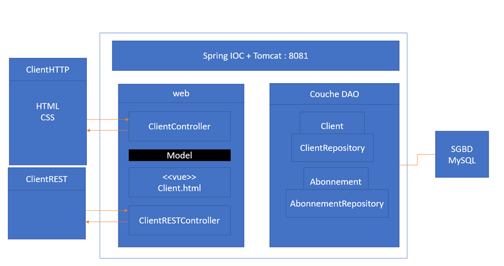
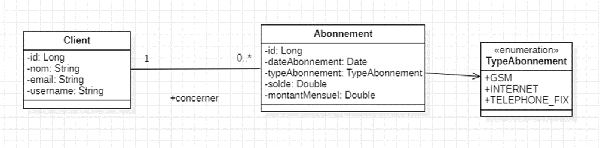
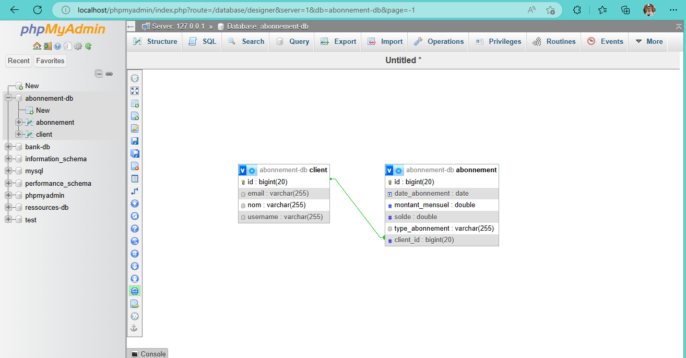
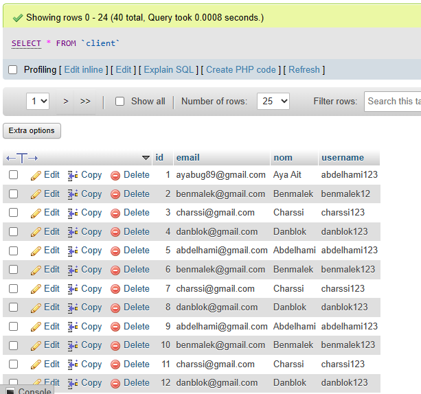
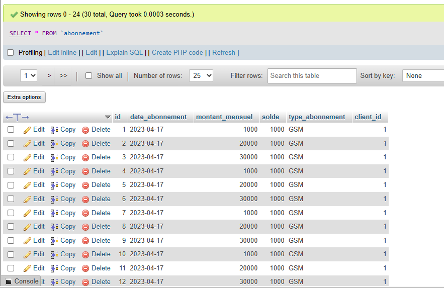

## 1. Schéma du projet


## 2. Diagramme de classe représentant les données manipulées par l’application


## 3. Couche DAO
### 3.1. Application.properties
Commençons par le fichier application.properties qui se trouve dans le dossier resources. Ce fichier contient les informations de connexion à la base de données ainsi que le port sur lequel le serveur va tourner. Il contient aussi des informations sur le cache de thymeleaf et sur la configuration de la base de données.

Nous allons aussi désactiver le cache de thymeleaf pour que les modifications soient prises en compte à chaque fois que nous allons recharger la page.

Fichier ***application.properties*** :
```properties
spring.datasource.url=jdbc:mysql://localhost:3306/abonnement-db?createDatabaseIfNotExist=true
spring.datasource.username=root
spring.datasource.password=

#Tomcat port
server.port=8081

spring.jpa.hibernate.ddl-auto=update
spring.jpa.properties.hibernate.dialect=org.hibernate.dialect.MySQL5Dialect
spring.jpa.show-sql=true

#Thymeleaf cache
spring.thymeleaf.cache=false
```

### 3.2. Créer les entités JPA

Nous allons créer les entités JPA qui vont nous permettre de manipuler les données de la base de données. Nous allons créer une entité pour chaque table de la base de données.

Nous allons créer une entité ***Abonnement*** qui va représenter la table ***abonnement*** de la base de données et une entité ***Client*** qui va représenter la table ***client*** de la base de données.
Fichier ***Client.java*** :
```java
@Entity
@Data @NoArgsConstructor @AllArgsConstructor @Builder
public class Client {
    @Id @GeneratedValue(strategy = GenerationType.IDENTITY)
    private Long id;
    private String nom;
    private String email;
    private String username;

    //Un client peut avoir plusieurs abonnements
    @OneToMany(fetch = FetchType.LAZY, mappedBy = "client")
    private Collection<Abonnement> abonnements;

}
```

Fichier ***Abonnement.java*** :
```java
@Entity
@Data @NoArgsConstructor @AllArgsConstructor @Builder
public class Abonnement {
    //Un abonnement est défini par : son id, la date d’abonnement, le type d’abonnement
    //(GSM, INTERNET, TELEPHONE_FIXE), son solde, et le montant mensue
    @Id @GeneratedValue(strategy = GenerationType.IDENTITY)
    private Long id;
    @Temporal(TemporalType.DATE)
    private Date dateAbonnement;
    @Enumerated(EnumType.STRING)
    private TypeAbonnement typeAbonnement;
    private double solde;
    private double montantMensuel;
    //Un abonnement est associé à un client

    @ManyToOne
    @JsonProperty(access = JsonProperty.Access.WRITE_ONLY)
    private Client client;
}
```

Puis dans un package ***enums*** nous allons créer une énumération ***TypeAbonnement*** qui va nous permettre de définir les différents types d’abonnement.

Fichier ***TypeAbonnement.java*** :
```java
public enum TypeAbonnement {
    GSM, INTERNET, TELEPHONE_FIXE
}
```

### 3.3. Créer les interfaces JpaRepository basées sur Spring Data

Nous allons créer les interfaces JpaRepository basées sur Spring Data qui vont nous permettre de manipuler les données de la base de données. Nous allons créer une interface pour chaque entité JPA.

- Créer une interface ***ClientRepository*** qui va étendre ***JpaRepository*** et qui va prendre en paramètre l’entité ***Client*** et le type de l’id de l’entité ***Client***.

Fichier ***ClientRepository.java*** :
```java
public interface ClientRepository extends JpaRepository<Client, Long> {
}
```

- Créer une interface ***AbonnementRepository*** qui va étendre ***JpaRepository*** et qui va prendre en paramètre l’entité ***Abonnement*** et le type de l’id de l’entité ***Abonnement***.

Fichier ***AbonnementRepository.java*** :
```java
public interface AbonnementRepository extends JpaRepository<Abonnement, Long> {
}
```

### 3.4. Tester les interfaces JpaRepository
Pour tester la couche DAO, nous allons utiliser le CommandLineRunner qui va nous permettre d’insérer des données dans la base de données.

- GestionAbonnementApplication.java
```java
@Bean
CommandLineRunner start(ClientRepository clientRepository, AbonnementRepository abonnementRepository) {
        return args -> {

            Stream.of("Abdelhami", "Benmalek", "Charssi", "Danblok").forEach(nom -> {
                Client c1 = new Client();
                c1.setNom(nom);
                c1.setEmail(nom.toLowerCase() + "@gmail.com");
                c1.setUsername(nom.toLowerCase()+"123");
                clientRepository.save(c1);
            });
            
            Stream.of(1000.0,20000.0,30000.0).forEach(montant -> {
                Abonnement a1 = new Abonnement();
                a1.setClient(clientRepository.findById(1L).get());
                a1.setSolde(1000.0);
                a1.setMontantMensuel(montant);
                a1.setDateAbonnement(new Date());
                a1.setTypeAbonnement(TypeAbonnement.GSM);
                abonnementRepository.save(a1);
            });
        };
    }
```







## 4. Couche Web
### 4.1. Créer les contrôleurs
Nous créons le package ***controllers***.

Nous allons créer les contrôleurs qui vont nous permettre de gérer les requêtes HTTP. Nous allons créer un contrôleur pour chaque entité JPA.

- Créer un contrôleur ***ClientController*** qui va prendre en paramètre l’interface ***ClientRepository***.

Fichier ***ClientWebController.java*** :
```java
@Controller
public class ClientWebController {
    private final ClientRepository clientRepository;

    public ClientWebController(ClientRepository clientRepository) {
        this.clientRepository = clientRepository;
    }
    @GetMapping("/index")
    public String chercher(Model model, @RequestParam(name="page",defaultValue = "0") int page, @RequestParam(name="motCle",defaultValue = "") String motCle){
        Page<Client> clients = clientRepository.findByNomContains(motCle, PageRequest.of(page,5));
        model.addAttribute("clients",clients.getContent());
        model.addAttribute("pages",new int[clients.getTotalPages()]);
        model.addAttribute("currentPage",page);
        model.addAttribute("motCle",motCle);
        return "clients";
    }
    @PostMapping("/saveClient")
    public String saveClient(@Validated Client client, BindingResult bindingResult){
        clientRepository.save(client);
        return "redirect:/index";
    }

    @GetMapping("/edit")
    public String editClient(@RequestParam(name = "id") Long id, Model model){
        Client client=clientRepository.findById(id).get();
        model.addAttribute("client",client);
        return "edit";
    }

    @GetMapping("/delete")
    public String deleteClient(@RequestParam(name = "id") Long id){
        clientRepository.deleteById(id);
        return "redirect:/index";
    }


}
```

- Créer un contrôleur ***AbonnementController*** qui va prendre en paramètre l’interface ***AbonnementRepository***.


Fichier ***AbonnementWebController.java*** :
```java
@Controller
public class AbonnementWebController {
    private final AbonnementRepository abonnementRepository;

    public AbonnementWebController(AbonnementRepository abonnementRepository) {
        this.abonnementRepository = abonnementRepository;
    }
    @GetMapping("/abonnements")
    public String chercher(Model model, @RequestParam(name="page",defaultValue = "0") int page, @RequestParam(name="motCle",defaultValue = "") String motCle){
        Page<Abonnement> abonnements = abonnementRepository.findAll(PageRequest.of(page,5));
        model.addAttribute("abonnements",abonnements.getContent());
        model.addAttribute("pages",new int[abonnements.getTotalPages()]);
        model.addAttribute("currentPage",page);
        model.addAttribute("motCle",motCle);
        return "abonnements";
    }
    @GetMapping("/deleteAbonnement")
    public String deleteAbonnement(@RequestParam(name = "id") Long id){
        abonnementRepository.deleteById(id);
        return "redirect:/abonnements";
    }


}
```

### 4.2. Créer les vues

- Créer un dossier ***templates*** dans le dossier ***resources***.
- Créer un dossier ***clients*** dans le dossier ***templates***.

- Créer un fichier ***clients.html*** dans le dossier ***clients***.
- Créer un fichier ***edit.html*** dans le dossier ***clients***.
- Créer un fichier ***abonnements.html*** dans le dossier ***templates***.
- Créer un fichier ***index.html*** dans le dossier ***templates***.


Fichier ***clients.html*** :
```html
<!DOCTYPE html>
<html xmlns:th="http://www.thymeleaf.org">
<head>
    <meta charset="UTF-8">
    <title>Clients</title>
    <link rel="stylesheet" href="https://cdnjs.cloudflare.com/ajax/libs/twitter-bootstrap/3.4.0/css/bootstrap.min.css">
    <!--<link rel="stylesheet" href="../static/css/bootstrap.min.css" th:href="@{css/bootstrap.min.css}">-->
</head>
<body>
<div class="container">
    <div class="panel panel-primary">
        <div class="panel-heading">
            <h3 class="panel-title">Clients</h3>
        </div>
        <div class="panel-body">
            <form th:action="@{/index}" method="get">
                <label>
                    Mot clé :
                    <input type="text"
                           name="motCle"
                           th:value="${motCle}"/>
                </label>

                <button type="submit" class="btn btn-primary">Recherche</button>
            </form>
        </div>
        <div class="panel-body">
            <p>Voici la liste des Clients</p>
            <table class="table">
                <tr>
                    Un client est défini par : sont id, son nom, son email et son username
                    <th>ID</th>
                    <th>Nom</th>
                    <th>Email</th>
                    <th>Username</th>
                </tr>
                <tr th:each="client : ${clients}">
                    <td th:text="${client.id}"></td>
                    <td th:text="${client.nom}"></td>
                    <td th:text="${client.email}"></td>
                    <td th:text="${client.username}"></td>
                    <td>
                        <a th:href="@{/edit(id=${client.id})}">Editer</a>
                        <a th:href="@{/delete(id=${client.id})}">Supprimer</a>
                    </td>
            </table>
            <ul class="pagination">
                <li th:class="${currentPage==status.index}?'active':''" th:each="page,status : ${pages}">
                    <a th:href="@{/index(page=${status.index}, motCle=${motCle})}" th:text="${status.index+1}"></a>
                </li>
            </ul>
        </div>
    </div>
</div>
</body>
</html>
```

Fichier ***edit.html*** :
```html
<!DOCTYPE html>
<html lang="en" xmlns:th="http://www.thymeleaf.org"
      xmlns:layout="http://www.ultraq.net.nz/thymeleaf/layout"
      layout:decorate="template.html"
>
<head>
  <meta charset="UTF-8">
  <title>Modifier Client</title>
  <link rel="stylesheet" href="https://cdnjs.cloudflare.com/ajax/libs/twitter-bootstrap/3.4.0/css/bootstrap.min.css">
</head>
<body>
<div layout:fragment="content">
  <div class="p-3">
    <form method="post" th:action="@{saveClient}">
      <div class="mb-3 mt-3">
        <label for="id" class="form-label">ID:</label>
        <label th:text="${client.id}"></label>
        <input type="hidden" class="form-control" id="id" placeholder="ID" name="id" th:value="${client.id}">
      </div>
      <div class="mb-3 mt-3">
        <label for="nom" class="form-label">Nom:</label>
        <input type="text" class="form-control" id="nom" placeholder="Nom" name="nom" th:value="${client.nom}">
        <span class="text-danger" th:errors="${client.nom}"></span>
      </div>
      <div class="mb-3">
        <label for="email" class="form-label">Email:</label>
        <input type="text" class="form-control" id="email" placeholder="Email Client"
               name="email" th:value="${client.email}">
      </div>
      <div class="mb-3 mt-3">
        <label for="username" class="form-label">Username:</label>
        <input type="text" class="form-control" id="username" placeholder="Username"
               name="username" th:value="${client.username}">

      </div>
      <button type="submit" class="btn btn-primary">Save</button>
    </form>
  </div>
</div>
</body>
</html>

```

Fichier ***abonnements.html*** :
```html
<!DOCTYPE html>
<html xmlns:th="http://www.thymeleaf.org">
<head>
  <meta charset="UTF-8">
  <title>Abonnement</title>
  <link rel="stylesheet" href="https://cdnjs.cloudflare.com/ajax/libs/twitter-bootstrap/3.4.0/css/bootstrap.min.css">
  <!--<link rel="stylesheet" href="../static/css/bootstrap.min.css" th:href="@{css/bootstrap.min.css}">-->
</head>
<body>
<div class="container">
  <div class="panel panel-primary">
    <div class="panel-heading">
      <h3 class="panel-title">Abonnement</h3>
    </div>
    <div class="panel-body">
      <form th:action="@{/abonnements}" method="get">
        <label>
          Mot clé :
          <input type="text"
                 name="motCle"
                 th:value="${motCle}"/>
        </label>

        <button type="submit" class="btn btn-primary">Recherche</button>
      </form>
    </div>
    <div class="panel-body">
      <p>Voici la liste des Abonnement</p>
      <table class="table">
        <tr>
          Un abonnement est défini par : son id
          <th>ID</th>
        </tr>
        <tr th:each="abonnement : ${abonnements}">
          <td th:text="${abonnement.id}"></td>

          <td>
            <a th:href="@{/edit(id=${abonnement.id})}">Editer</a>
            <a th:href="@{/delete(id=${abonnement.id})}">Supprimer</a>
          </td>
      </table>
      <ul class="pagination">
        <li th:class="${currentPage==status.index}?'active':''" th:each="page,status : ${pages}">
          <a th:href="@{/abonnements(page=${status.index}, motCle=${motCle})}" th:text="${status.index+1}"></a>
        </li>
      </ul>
    </div>
  </div>
</div>
</body>
</html>
```

---

